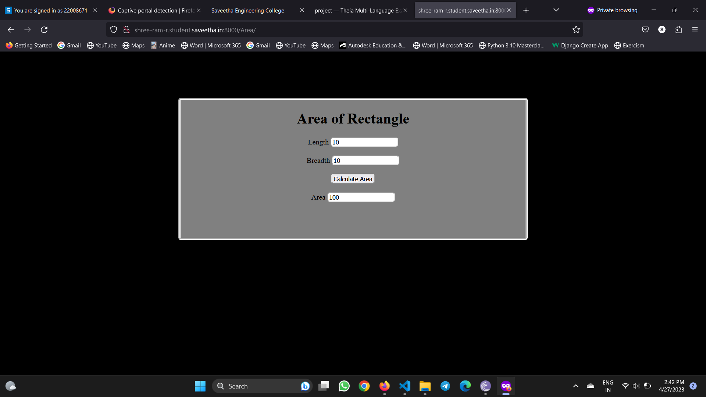

# Design a Website for Server Side Processing

## AIM:
To design a website to perform mathematical calculations in server side.

## DESIGN STEPS:

### Step 1:

First fork the template repository to your git hub account and clone it in theia IDE. Now start working in the local repository.

### Step 2:

Create a new project folder and a app too. Create a template for your website using HTML and CSS.
Create appropiate view method for your template.

### Step 3:

Use internal CSS it is easy work with when we use only one template.
Use POST method instead of GET inorder to gain efficiency.

### Step 4:

Publish the website in the given URL.

## PROGRAM :
### HTML and CSS code:
```
<!DOCTYPE html>
<html lang="en">
  <head>
    <style type="text/css">
      * {
        border-radius: 5px;
      }
      body {
        background-color: black;
      }
      .color1 {
        background-color: grey;
      }
      .color2 {
        background-color: grey;
      }
      .color3 {
        background-color: #ff0037;
      }
      #calculation {
        width: 750px;
        height: 300px;
        margin-left: auto;
        margin-right: auto;
        margin-top: 100px;
        margin-bottom: auto;
        border-width: 5px;
        border-color: #fff;
        border-style: groove;
      }
      .block {
        text-align: center;
        width: 375px;
        height: 40px;
        border-radius: 0px;
        margin-top: auto;
        margin-bottom: auto;
        margin-left: auto;
        margin-right: auto;
        background-color: grey;
      }
    </style>
  </head>
  <body>
    <div id="calculation" class="color2" align="center">
      <h1>Area of Rectangle</h1>
      <form method="POST" action="/Area/">
        
        <div class="block">
          <label for="length">Length</label>
          <input type="text" name="length" id="length" value="{{ length }}" />
        </div>
        <div class="block">
          <label for="breadth">Breadth</label>
          <input
            type="text"
            name="breadth"
            id="breadth"
            value="{{ breadth }}"
          />
        </div>

        <div class="block">
          <input type="submit" value="Calculate Area" />
        </div>
        <div class="block">
          <label for="Area">Area</label>
          <input type="text" name="Area" id="Area" value="{{ Area }}" />
        </div>
      </form>
    </div>
  </body>
</html>

```
### server-side python program:
```python

def Areaofrectangle(request):
    context = {}
    context['length'] = "0"
    context['breadth'] = "0"

    context['Area'] = "0"
    if request.method == 'POST':
        print("POST method is used . . .")
        length = request.POST.get("length", 0)
        breadth = request.POST.get("breadth", 0)

        l_num = int(length)
        b_num = int(breadth)

        Area = l_num*b_num
        context['length'] = length
        context['breadth'] = breadth

        context['Area'] = Area
    return render(request, "myapp/area.html", context)


```

## OUTPUT:



## Result:
Thus a website has been successfully created to perform mathematical calculations in server side.

